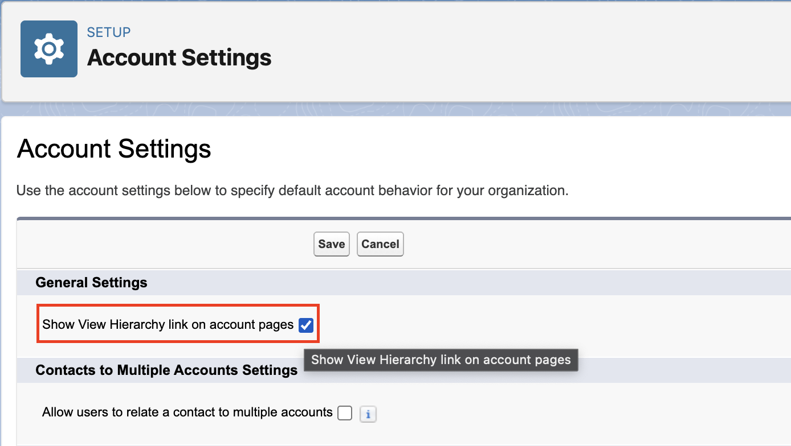
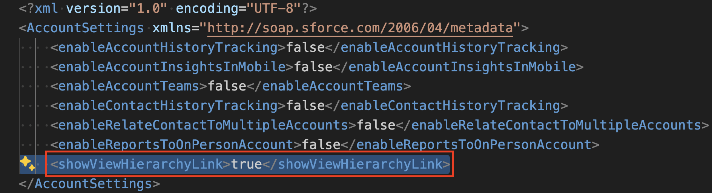
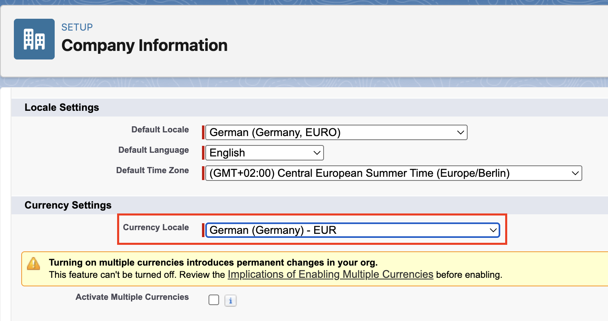

# sfdx-browserforce-plugin

> sfdx plugin to apply settings in the Salesforce Setup Menu using browser automation

[](https://github.com/amtrack/sfdx-browserforce-plugin/actions?query=branch:main)

✅ Most settings in the Salesforce Setup Menu are represented as [Settings](https://developer.salesforce.com/docs/atlas.en-us.api_meta.meta/api_meta/meta_settings.htm) in the Metadata API.

For example, the highlighted checkbox "Show View Hierarchy link on account pages" in Account Settings is indeed represented in the Metadata `AccountSettings` as `showViewHierarchyLink`.

|                                                                                   |                                                                   |
| --------------------------------------------------------------------------------- | ----------------------------------------------------------------- |
|  |  |

⚡ **BUT**

> Not all feature settings are available in the Metadata API. See [Unsupported Metadata Types](https://developer.salesforce.com/docs/atlas.en-us.api_meta.meta/api_meta/meta_unsupported_types.htm) for information on which feature settings are not available.
>
> Source: [Metadata API Developer Guide | Settings](https://developer.salesforce.com/docs/atlas.en-us.api_meta.meta/api_meta/meta_settings.htm)

For example, the Currency Locale in `Setup -> Company Settings -> Company Information` is not represented in any Metadata.



👉 This is where Browserforce (sfdx-browserforce-plugin) comes to the rescue. It fills this gap by applying these unsupported settings through browser automation!

## Example

To change the Currency Locale, the Browserforce config file (here: `./config/currency.json`) looks like this:

```json
{
  "$schema": "./src/plugins/schema.json",
  "settings": {
    "companyInformation": {
      "defaultCurrencyIsoCode": "English (South Africa) - ZAR"
    }
  }
}
```

Apply the config:

```console
$ sf browserforce apply -f ./config/currency.json --target-org myOrg@example.com
  logging in... done
  Applying definition file ./config/currency.json to org myOrg@example.com
  [CompanyInformation] retrieving state... done
  [CompanyInformation] changing 'defaultCurrencyIsoCode' to '"English (South Africa) - ZAR"'... done
  logging out... done
```

## Key Concepts

- 🔧 configuration using JSON Schema (similar to the [Scratch Org Definition Configuration](https://developer.salesforce.com/docs/atlas.en-us.sfdx_dev.meta/sfdx_dev/sfdx_dev_scratch_orgs_def_file.htm))
- 🧠 idempotency of the `apply` command only applies what's necessary and allows re-execution (concept similar to [terraform](https://www.terraform.io/docs/commands/apply.html))
- 🏎️ browser automation powered by Puppeteer and "Chrome for Testing", [learn more about Puppeteer and Browserforce](#puppeteer)

## Supported Browserforce Settings

Top settings:

- Change Currency Locale
- Delete inactive record types
- Replace (and delete) picklist values
- Manage (create/modify/delete) Field Dependencies on CustomFields
- Set Email Deliverability Access Level to "No access", "System email only" and "All email"
- Enable the 'Sales Cloud for Slack' Slack App
- Change active Lightning Theme
- Enable Salesforce To Salesforce
- Import certificates from a keystore in Java Keystore (JKS) format

But there's more:

- Please see the [plugin documentation](./wiki/Browserforce-Settings) for all available settings and screenshots. 
- Explore the JSON schema powered configuration using the [full-blown example](./examples/full.json) or start with an [empty configuration](./examples/empty.json).

## Installation

There are several different methods to install `sfdx-browserforce-plugin`:

```shell
# as an sf plugin globally
sf plugins install sfdx-browserforce-plugin

# or standalone globally
npm install --global sfdx-browserforce-plugin

# or standalone locally (as a dependency in your Node.js project)
npm install --save-dev sfdx-browserforce-plugin
```

## Usage

Depending on your choice of installation, you can find the `browserforce` namespace:

```shell
# globally in the sf cli
sf browserforce

# globally in the sfdx-browserforce-plugin executable
sfdx-browserforce-plugin browserforce

# locally in the sfdx-browserforce-plugin executable (npx is awesome!)
npx sfdx-browserforce-plugin browserforce
```

```console
$ sfdx-browserforce browserforce -h
browser automation

USAGE
  $ sfdx-browserforce-plugin browserforce COMMAND

COMMANDS
  browserforce apply  apply a plan from a definition file
  browserforce plan   retrieve state and generate plan file
```

Both the `browserforce apply` and `browserforce plan` commands expect a config file and a target username or alias for the org.

## Environment Variables

- `BROWSER_DEBUG` run in non-headless mode (default: `false`)
- `BROWSERFORCE_NAVIGATION_TIMEOUT_MS`: adjustable for slow internet connections (default: `90000`)
- `BROWSERFORCE_RETRY_MAX_RETRIES`: number of retries on failures opening a page (default: `4`)
- `BROWSERFORCE_RETRY_TIMEOUT_MS`: initial time between retries in exponential mode (default: `4000`)

## Puppeteer

We use [Puppeteer](https://github.com/puppeteer/puppeteer) for browser automation which comes with its own "Chrome for Testing" browser.

The puppeteer [installation doc](https://github.com/puppeteer/puppeteer#installation) describes how this works:

> When you install Puppeteer, it automatically downloads a recent version of
> [Chrome for Testing](https://goo.gle/chrome-for-testing) (~170MB macOS, ~282MB Linux, ~280MB Windows) that is [guaranteed to
> work](https://pptr.dev/faq#q-why-doesnt-puppeteer-vxxx-work-with-chromium-vyyy)
> with Puppeteer. The browser is downloaded to the `$HOME/.cache/puppeteer` folder
> by default (starting with Puppeteer v19.0.0).

In most of the cases this just works! If you still want to skip the download and use another browser installation, you can do this as follows:

```console
export PUPPETEER_SKIP_CHROMIUM_DOWNLOAD=true
sf plugins install sfdx-browserforce-plugin
export PUPPETEER_EXECUTABLE_PATH=/usr/bin/chromium-browser
sf browserforce:apply ...
```

## Troubleshooting

- The installation is triggered via the `postinstall` hook of npm/yarn. If you've disabled running scripts with npm (`--ignore-scripts` or via config file), it will not download the browser.

## Contributing

Please see [CONTRIBUTING.md](CONTRIBUTING.md) for getting started.

## Sponsors

- [PARX](https://www.parx.com)
- [IPfolio](https://www.ipfolio.com)

## License

MIT © [Matthias Rolke](mailto:mr.amtrack@gmail.com)
